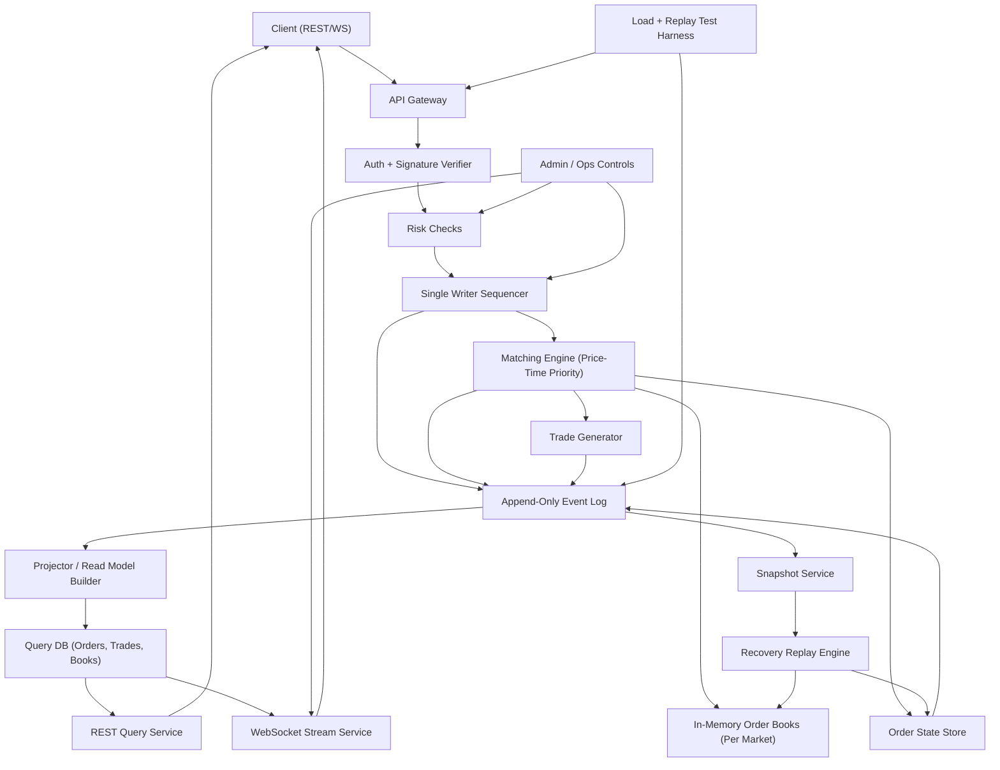
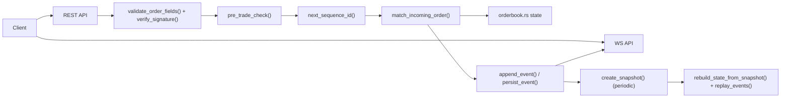

# Phase -1: Web2-First CLOB Requirements (On-chain Compatible)

## 1) Product Goal
- Build a production-grade Web2 CLOB matching engine that can be used by centralized exchanges.
- Support full Level 3 (order-by-order) book management and market data.
- Optimize for low-latency matching, deterministic sequencing, and operational reliability.
- Keep architecture compatible with future NEAR on-chain settlement integration.

Success criteria for this phase:
- Engine supports order placement, cancel, and matching with strict price-time priority.
- P95 latency:
  - order ack <= 10 ms
  - cancel ack <= 10 ms
  - match event publication <= 25 ms
- Throughput benchmark target: >= 10,000 order actions/sec on test environment (define hardware profile).
- Deterministic replay: full book and trade state can be rebuilt exactly from event log.
- Level 3 feed is complete and consistent with internal state.
- Book depth is unbounded at protocol level (practically limited by configured infra/storage constraints).

## 2) Scope (In)
- Limit orders only (`GTC`).
- Cancel by `order_id` and `client_order_id`.
- Partial/full fills.
- Strict price-time priority matching.
- Maker/taker fee model.
- Multi-market support with isolated books per `market_id`.
- Level 3 (order-by-order) state and feed.
- Deterministic single-writer sequencing.
- Append-only event log as source of truth.
- Idempotent submit/cancel behavior for retries.
- Snapshot + replay recovery.
- Load/stress testing for latency and throughput.

## 3) Scope (Out)
- Margin engine
- Liquidations
- Market orders
- IOC/FOK
- Advanced order types (stop, iceberg, post-only variants)
- Fraud proofs / dispute game

## 4) Canonical Order Schema (Freeze Early)
- Required fields:
  - `schema_version: u16`
  - `order_id: uuid/string` (server-generated, returned after acceptance)
  - `client_order_id: string` (client-generated idempotency key, unique per trader per market window)
  - `market_id: string`
  - `trader_id: string`
  - `side: enum { buy, sell }`
  - `price_ticks: u64` (integer ticks only)
  - `size_lots: u64` (integer lots only)
  - `time_in_force: enum { GTC }`
  - `nonce: u64` (monotonic per trader)
  - `expiry_ts_ms: u64` (epoch ms; reject if expired)
  - `created_at_ms: u64` (client-side timestamp, informational)
  - `salt: u64` (optional randomness, recommended)
- Serialization format:
  - Canonical JSON with fixed field order and no optional ambiguity, or canonical binary encoding.
  - Recommendation: canonical binary encoding for signing and hashing stability.
- Hash function:
  - `order_hash = SHA-256(canonical_encoded_order_without_signature)`
- Signature algorithm:
  - `ed25519` over `order_hash`
- Signed payload:
  - Sign exactly the canonical encoded order fields (excluding signature fields).
- Versioning strategy:
  - `schema_version` required in every order.
  - Any breaking change bumps version and uses a temporary dual-parser window.

## 5) Matching Rules
- Matching priority:
  - Strict price-time priority.
  - Buy orders match lowest available ask first.
  - Sell orders match highest available bid first.
- Tie-breaker rule:
  - Earlier sequencer-accepted timestamp wins.
  - If same timestamp, lower `sequence_id` wins (single-writer sequencer guarantees uniqueness).
- Partial fill behavior:
  - If incoming order size > resting size, consume resting order and continue.
  - If incoming order size < resting size, partially fill resting order and stop/continue based on remaining.
  - Residual from incoming GTC order rests on the book at original limit price.
- Trade price rule:
  - Execution price is resting (maker) order price.
- Self-trade policy:
  - STP mode for Phase -1 is `Cancel Taker` (locked).
  - If incoming taker would match resting order from same `trader_id`, incoming taker quantity is canceled.
  - Resting maker order remains unchanged on the book.
- Tick size / lot size enforcement:
  - Reject if `price_ticks % tick_size != 0`.
  - Reject if `size_lots % lot_size != 0`.
  - Reject non-positive price or size.
- Rejection rules:
  - Unknown market.
  - Market paused/halted.
  - Invalid signature.
  - Nonce already used or lower than last accepted nonce policy.
  - Order expired at intake time.
  - Duplicate `client_order_id` for active idempotency window.
  - Insufficient available balance/risk limit breach.
- Cancel rules:
  - Cancel allowed only by owning `trader_id` (or authorized admin path).
  - Cancel on already filled/canceled order returns idempotent success.
- Determinism rules:
  - All matching decisions depend only on sequenced input events.
  - No wall-clock dependent logic inside matching path.

## 6) API Surface (Web2)
- `POST /v1/orders`
- `DELETE /v1/orders/{order_id}`
- `POST /v1/orders/cancel-by-client-id`
- `GET /v1/orders/{order_id}`
- `GET /v1/books/{market_id}?depth={n}`
- `GET /v1/trades/{market_id}?limit={n}&from_sequence={seq}`
- `GET /v1/markets`
- `WS /v1/stream` (L3 updates, trades, order status)

For each endpoint, define:
- Request schema:
- Validation rules:
- Response schema:
- Error codes:

### `POST /v1/orders`
- Request schema:
  - `client_order_id`
  - `market_id`
  - `trader_id`
  - `side`
  - `price_ticks`
  - `size_lots`
  - `time_in_force` (`GTC`)
  - `nonce`
  - `expiry_ts_ms`
  - `salt` (optional)
  - `signature`
- Validation rules:
  - signature valid
  - nonce policy valid
  - not expired
  - tick/lot valid
  - market active
  - risk checks pass
  - idempotent on `client_order_id`
- Response schema:
  - `order_id`
  - `order_hash`
  - `status` (`accepted` | `rejected`)
  - `reason_code` (if rejected)
  - `sequence_id`
  - `accepted_at_ms`
- Error codes:
  - `INVALID_SIGNATURE`
  - `MARKET_NOT_FOUND`
  - `MARKET_HALTED`
  - `INVALID_TICK_SIZE`
  - `INVALID_LOT_SIZE`
  - `NONCE_INVALID`
  - `ORDER_EXPIRED`
  - `INSUFFICIENT_BALANCE`
  - `IDEMPOTENCY_CONFLICT`

### `DELETE /v1/orders/{order_id}`
- Request schema:
  - path `order_id`
  - auth context (`trader_id`)
- Validation rules:
  - ownership/admin check
  - idempotent if already canceled/filled
- Response schema:
  - `order_id`
  - `status` (`canceled` | `already_closed` | `not_found`)
  - `sequence_id`
  - `canceled_at_ms`
- Error codes:
  - `UNAUTHORIZED_CANCEL`
  - `ORDER_NOT_FOUND`

### `POST /v1/orders/cancel-by-client-id`
- Request schema:
  - `trader_id`
  - `market_id`
  - `client_order_id`
- Validation rules:
  - maps to unique active/closed order
  - idempotent behavior
- Response schema:
  - `order_id`
  - `status`
  - `sequence_id`
- Error codes:
  - `ORDER_NOT_FOUND`
  - `UNAUTHORIZED_CANCEL`

### `GET /v1/orders/{order_id}`
- Response schema:
  - `order_id`
  - `client_order_id`
  - `market_id`
  - `trader_id`
  - `side`
  - `price_ticks`
  - `orig_size_lots`
  - `filled_size_lots`
  - `remaining_size_lots`
  - `status` (`open` | `partially_filled` | `filled` | `canceled` | `rejected`)
  - `created_sequence`
  - `last_update_sequence`

### `GET /v1/books/{market_id}`
- Response schema:
  - `market_id`
  - `sequence_id`
  - `bids` (price level or L3 order rows; choose one response mode)
  - `asks`
  - `snapshot_at_ms`

### `GET /v1/trades/{market_id}`
- Response schema:
  - list of trades with:
    - `trade_id`
    - `sequence_id`
    - `market_id`
    - `price_ticks`
    - `size_lots`
    - `maker_order_id`
    - `taker_order_id`
    - `timestamp_ms`

### `WS /v1/stream`
- Channels:
  - `book.l3.{market_id}`
  - `trades.{market_id}`
  - `orders.{trader_id}` (private)
- Event envelope:
  - `channel`
  - `sequence_id`
  - `event_type`
  - `payload`
  - `timestamp_ms`
- Guarantees:
  - per-channel in-order delivery
  - reconnect supports `from_sequence`
  - clients detect gaps and resync via REST snapshot + replay

## 7) Sequencer and Event Log
- Sequencer source of truth:
  - Single-writer sequencer assigns strictly increasing `sequence_id` to every state-changing event.
  - Matching engine consumes only sequenced events, never raw API arrival order.
- Event types:
  - `order_received`
  - `order_accepted`
  - `order_rejected`
  - `order_matched`
  - `order_partially_filled`
  - `order_filled`
  - `order_canceled`
  - `market_paused`
  - `market_resumed`
- Event ordering guarantees:
  - Global total order by `sequence_id`.
  - No gaps in committed log.
  - Consumers process strictly in ascending `sequence_id`.
- Idempotency guarantees:
  - `client_order_id` is idempotency key for submissions.
  - Duplicate submit returns prior result without new state transition.
  - Duplicate cancel returns idempotent success when order already closed.
- Replay procedure to rebuild full state:
  - Load latest snapshot (`snapshot_sequence`).
  - Replay all events where `sequence_id > snapshot_sequence`.
  - Reconstruct books, order states, and trade history deterministically.
  - Validate replay by checksum/hash of final in-memory state.

## 8) Risk and Controls (Web2)
- Pre-trade checks:
  - Trader account active and authorized for market.
  - Sufficient available balance/credit limits.
  - Max order size and max open orders per trader.
  - Valid nonce and non-expired order.
- Rate limits / abuse controls:
  - Per-IP and per-trader request quotas.
  - Burst + sustained limits with temporary throttling.
  - Abuse flags for excessive rejects/cancel spam.
- Market pause controls:
  - Market-level pause/resume switch.
  - Global pause switch for emergency operation.
- Circuit breaker logic:
  - Reject orders outside configured dynamic price bands.
  - Optional volatility halt if price moves exceed threshold in time window.
- Operator/admin permissions:
  - Role-based access (`admin`, `risk_admin`, `ops_readonly`).
  - All privileged actions logged with actor id and reason.

## 9) Data Model
- In-memory structures for live matching:
  - Per-market bid and ask trees/heaps keyed by price.
  - FIFO queues per price level for time priority.
  - `order_id -> order_state` map.
- Persistent storage tables/collections:
  - `orders`
  - `order_events`
  - `trades`
  - `markets`
  - `balances` (or risk ledger references)
  - `snapshots`
- Key indexes:
  - `orders(order_id)` primary
  - `orders(trader_id, client_order_id)` unique in idempotency window
  - `order_events(sequence_id)` unique
  - `trades(market_id, sequence_id)`
  - `orders(market_id, status, price_ticks, created_sequence)`
- Archival policy:
  - Hot storage for recent events/trades.
  - Periodic compaction and cold archival by sequence ranges.
  - Snapshots retained for fast recovery and audit windows.

## 10) Observability and Ops
- Metrics:
  - API p50/p95/p99 latency by endpoint.
  - Match throughput (orders/sec, trades/sec).
  - Reject rate by reason code.
  - Sequencer lag and queue depth.
  - Replay duration and recovery RTO.
- Logs and tracing requirements:
  - Structured logs with `sequence_id`, `order_id`, `market_id`, `trader_id`.
  - Correlation id per API request across services.
  - Audit logs for all admin/risk actions.
- Alert conditions:
  - Latency SLO breach.
  - Reject-rate spike.
  - Sequencer stall or sequence gap detection.
  - Snapshot/replay failure.
  - WS disconnect/error spike.
- Recovery runbook:
  - Stop intake.
  - Load latest snapshot.
  - Replay journal to head.
  - Validate state checksum.
  - Resume intake and monitor elevated alerts.

## 11) Security Requirements
- Signature verification policy (mandatory from day 1):
  - Every order must include valid signature over canonical payload.
  - Verification happens before risk checks and sequencing acceptance.
- Key rotation approach:
  - Trader keys can be rotated via authenticated account flow.
  - Old keys invalidated at configured cutover sequence/time.
- Replay protection model:
  - Monotonic nonce policy per trader.
  - `client_order_id` uniqueness in configured time window.
  - Expiry enforcement at intake.
- Audit trail requirements:
  - Immutable event log with sequence ordering.
  - Full traceability from API request to resulting events/trades.
  - Retain audit data per compliance retention policy.

## 12) NEAR Migration Readiness (Future)
- Keep exact same order hash on-chain:
  - Do not change canonical field set or serialization after freeze.
- Maintain `filled_amount[order_hash]` semantics:
  - Off-chain and future on-chain systems must compute remaining size identically.
- Maintain `cancelled[order_hash]` semantics:
  - Canceled orders cannot be revived.
- Keep deterministic settlement constraints:
  - Same matching inputs must produce same fill outputs.
  - No hidden mutable parameters in match path.
- Gaps to close before on-chain settlement:
  - Replace trusted off-chain balance ledger with on-chain vault accounting.
  - Add on-chain verification of signatures, nonce, expiry, and fill constraints.
  - Define settlement batch format and gas-bounded execution strategy.

## 13) Milestones and Exit Criteria
- M1: Signed order intake working
- M2: Deterministic matching + replay passing
- M3: Stable API + WS feeds
- M4: Ops baseline and incident runbook
- Exit criteria for Phase -1:
  - All Scope (In) features are complete and tested.
  - Deterministic replay validated on production-like datasets.
  - Load/stress test meets baseline targets or documented deviations.
  - On-call runbook and alerts are operational.
  - Canonical order schema and hash/signature spec are frozen.

## 14) Development Order
1. Lock canonical serialization, hashing/signature flow, and nonce policy in writing.
2. Implement sequencer and append-only event model.
3. Implement in-memory orderbook and matching rules (price-time priority, STP, partial fills).
4. Implement persistence layer and snapshot/replay recovery.
5. Implement REST and WebSocket APIs.
6. Implement risk checks and control paths (pause, limits, circuit breakers).
7. Run deterministic replay tests, then load/stress tests, and tune bottlenecks.

## 15) Architecture Diagram (Phase -1)

## 16) Files and Functions to Implement First

### Progress tracker
- [x] `src/domain/order.rs` — complete (2026-03-07)
- [x] `src/domain/market.rs` — complete (2026-03-07)
- [ ] `src/sequencer/mod.rs`
- [ ] `src/engine/orderbook.rs`
- [ ] `src/engine/matching.rs`
- [ ] `src/events/mod.rs`
- [ ] `src/replay/mod.rs`
- [ ] `src/api/rest.rs` / `ws.rs`
- [ ] `src/risk/mod.rs`
- [ ] `src/snapshot/mod.rs`
- [ ] `src/ops/admin.rs`

---

1. `src/domain/order.rs` ✅ (2026-03-07)
- `validate_fields` — stateless field checks (schema version, non-empty fields, price/size > 0, expiry)
- `canonical_hash` — frozen SHA-256 binary encoding, NEAR-compatible, field layout documented and frozen
- `verify_signature` — ed25519 over the canonical hash
- Types: `SignedOrder`, `Order`, `OrderHash`, `OrderId`, `Fill`, `Side`, `TimeInForce`, `OrderStatus`, `OrderError`
- Custom serde hex encoding for `[u8; 32]` / `[u8; 64]` fields
- 20 tests green

2. `src/domain/market.rs` ✅ (2026-03-07)
- `validate_price` — checks > 0 and tick_size alignment
- `validate_size` — checks > 0 and lot_size alignment
- `is_active` — market status gate used by engine before accepting orders
- Types: `MarketId`, `MarketConfig`, `MarketStatus`, `MarketError`
- 6 tests green

3. `src/sequencer/mod.rs`
- `next_sequence_id`
- `append_event`
- `idempotency_check`

4. `src/engine/orderbook.rs`
- `add_limit_order`
- `cancel_order`
- `best_bid`
- `best_ask`

5. `src/engine/matching.rs`
- `match_incoming_order`
- `apply_stp_cancel_taker`
- `create_fill_events`

6. `src/events/mod.rs`
- `serialize_event`
- `persist_event`
- `load_events_from`

7. `src/replay/mod.rs`
- `rebuild_state_from_snapshot`
- `replay_events`
- `state_checksum`

8. `src/api/rest.rs`
- `post_order`
- `cancel_order`
- `get_order`
- `get_book`
- `get_trades`

9. `src/api/ws.rs`
- `subscribe_channel`
- `publish_event`
- `resume_from_sequence`

10. `src/risk/mod.rs`
- `pre_trade_check`
- `enforce_limits`
- `price_band_check`

11. `src/snapshot/mod.rs`
- `create_snapshot`
- `load_latest_snapshot`

12. `src/ops/admin.rs`
- `pause_market`
- `resume_market`
- `set_circuit_breaker`

## 17) Open Questions
- Required latency SLO by market type (retail-focused vs HFT-focused)?
- Nonce policy choice: strictly monotonic vs sparse nonce windows?
- Fee model details: static tiers vs account-level dynamic tiers?
- Snapshot cadence and retention policy targets?
- Multi-region strategy in Phase -1 or deferred to later phase?

## 18) Folder Structure Flowchart

```mermaid
flowchart TD
    ROOT["/Users/prakharojha/Desktop/me/personal/CLOB"] --> SRC["src/"]
    SRC --> DOMAIN["domain/"]
    SRC --> ENGINE["engine/"]
    SRC --> SEQ["sequencer/"]
    SRC --> EVENTS["events/"]
    SRC --> REPLAY["replay/"]
    SRC --> API["api/"]
    SRC --> RISK["risk/"]
    SRC --> SNAP["snapshot/"]
    SRC --> OPS["ops/"]
    SRC --> MAIN["main.rs"]

    DOMAIN --> ORDER["order.rs"]
    DOMAIN --> MARKET["market.rs"]

    ENGINE --> BOOK["orderbook.rs"]
    ENGINE --> MATCH["matching.rs"]

    API --> REST["rest.rs"]
    API --> WS["ws.rs"]

    ORDER --> O1["validate_order_fields()"]
    ORDER --> O2["compute_order_hash()"]
    ORDER --> O3["verify_signature()"]

    MARKET --> M1["validate_tick_lot()"]
    MARKET --> M2["is_market_active()"]

    SEQ --> S1["next_sequence_id()"]
    SEQ --> S2["append_event()"]
    SEQ --> S3["idempotency_check()"]

    BOOK --> B1["add_limit_order()"]
    BOOK --> B2["cancel_order()"]
    BOOK --> B3["best_bid()"]
    BOOK --> B4["best_ask()"]

    MATCH --> X1["match_incoming_order()"]
    MATCH --> X2["apply_stp_cancel_taker()"]
    MATCH --> X3["create_fill_events()"]

    EVENTS --> E1["serialize_event()"]
    EVENTS --> E2["persist_event()"]
    EVENTS --> E3["load_events_from()"]

    REPLAY --> R1["rebuild_state_from_snapshot()"]
    REPLAY --> R2["replay_events()"]
    REPLAY --> R3["state_checksum()"]

    REST --> A1["post_order()"]
    REST --> A2["cancel_order()"]
    REST --> A3["get_order()"]
    REST --> A4["get_book()"]
    REST --> A5["get_trades()"]

    WS --> W1["subscribe_channel()"]
    WS --> W2["publish_event()"]
    WS --> W3["resume_from_sequence()"]

    RISK --> K1["pre_trade_check()"]
    RISK --> K2["enforce_limits()"]
    RISK --> K3["price_band_check()"]

    SNAP --> N1["create_snapshot()"]
    SNAP --> N2["load_latest_snapshot()"]

    OPS --> P1["pause_market()"]
    OPS --> P2["resume_market()"]
    OPS --> P3["set_circuit_breaker()"]
```

## 19) Runtime Request Flow

## Thoughts
1. 

## 20) Database Decision and Starter Schema
### Database Decision (Phase -1)
- Primary database: `PostgreSQL` (authoritative persistence for orders, events, trades, snapshots).
- Cache and stream fanout: `Redis` (optional in first milestone, recommended before load testing).
- Kafka: deferred; introduce only if Postgres + Redis cannot meet throughput targets.

### Source of Truth Rules
- `order_events` is the durable event journal for replay.
- `orders` and `trades` are query-optimized derived models.
- In-memory books are runtime state and must be reconstructable from snapshots + `order_events`.

### Starter Tables
1. `markets`
- `market_id` (PK)
- `base_asset`, `quote_asset`
- `tick_size`, `lot_size`
- `status` (`active`, `paused`, `halted`)
- `created_at_ms`, `updated_at_ms`

2. `orders`
- `order_id` (PK)
- `order_hash` (UNIQUE)
- `client_order_id`
- `market_id` (FK -> `markets.market_id`)
- `trader_id`
- `side`
- `price_ticks`
- `orig_size_lots`
- `filled_size_lots`
- `remaining_size_lots`
- `status`
- `nonce`
- `expiry_ts_ms`
- `created_sequence`
- `last_update_sequence`
- `created_at_ms`, `updated_at_ms`

3. `order_events`
- `sequence_id` (PK, BIGINT)
- `event_type`
- `market_id`
- `order_id` (nullable for non-order events)
- `trade_id` (nullable)
- `payload_json` (JSONB)
- `created_at_ms`

4. `trades`
- `trade_id` (PK)
- `sequence_id` (UNIQUE, FK -> `order_events.sequence_id`)
- `market_id`
- `price_ticks`
- `size_lots`
- `maker_order_id`
- `taker_order_id`
- `maker_trader_id`
- `taker_trader_id`
- `executed_at_ms`

5. `balances`
- `trader_id`
- `asset_id`
- `available`
- `locked`
- `updated_at_ms`
- PK: (`trader_id`, `asset_id`)

6. `snapshots`
- `snapshot_id` (PK)
- `snapshot_sequence`
- `snapshot_blob` (BYTEA/JSONB)
- `state_checksum`
- `created_at_ms`

### Required Indexes
- `orders(trader_id, client_order_id)` UNIQUE
- `orders(market_id, status, price_ticks, created_sequence)`
- `orders(order_hash)` UNIQUE
- `order_events(market_id, sequence_id)`
- `trades(market_id, sequence_id)`
- `trades(maker_order_id)`, `trades(taker_order_id)`

### Immediate Implementation Notes
- Keep all writes that mutate order state and append events in one DB transaction.
- Enforce monotonic `sequence_id` generation inside the sequencer path.
- Snapshot every N events (start with N=100k; tune from benchmarks).

## 21) Rust Execution Strategy (When Blocked)
### Why Implementation Feels Hard
- Architecture design and Rust implementation are being done at the same time.
- Domain invariants are still evolving, which causes constant type/model churn.
- Rust forces explicit typing, ownership, and error boundaries early.
- Building full modules before compile-safe slices increases friction.

### Working Method (Early Modules)
1. Build one invariant at a time, not one full subsystem.
2. Keep first passes pure and local (no DB/network/async until domain logic is stable).
3. Write minimal compile-first code, then tests, then extension.

### 60-Minute Unblock Flow
1. In `src/domain/order.rs`, define only:
- `Side`
- `TimeInForce`
- `SignedOrder` (fields only)
2. Implement only:
- `validate_order_fields(order, now_ms)`
3. Add only 3 tests:
- valid order passes
- expired order fails
- zero size fails
4. Run `cargo test` until green.
5. Log unclear points in `/Users/prakharojha/Desktop/me/personal/CLOB/logs/THOUGHT_LOG.md`.

### Scope Guardrails
- Do not implement hashing/signatures in the same pass as initial validation.
- Do not write migrations until `SignedOrder` fields and validation rules are stable.
- Do not add API handlers before domain tests are green.
